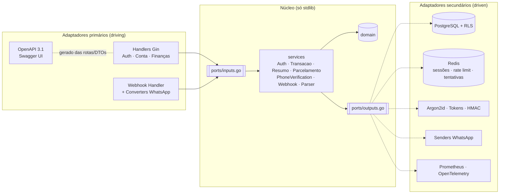
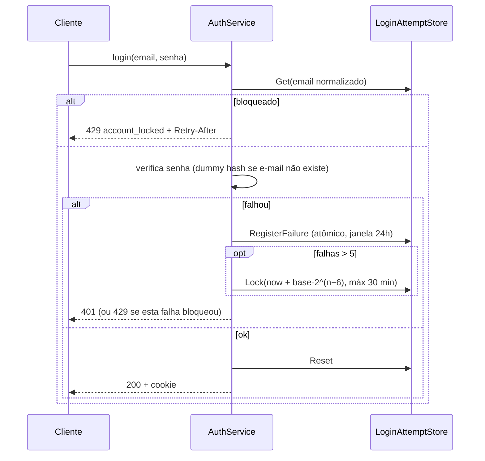
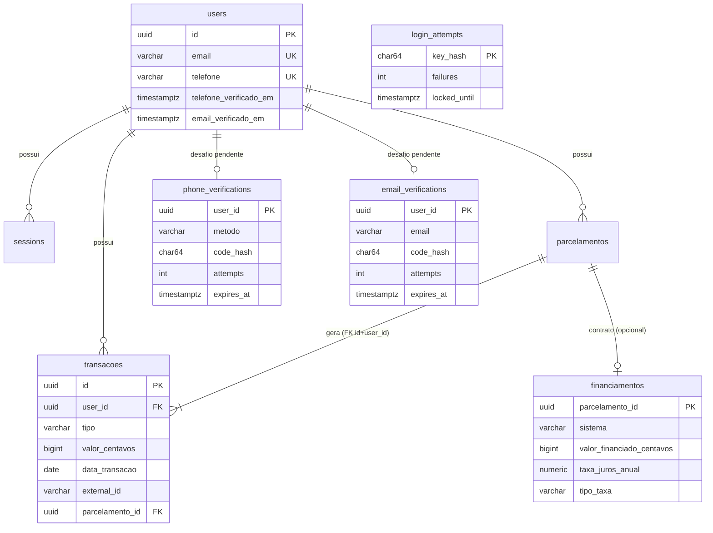

# QuantoDeu API — Especificação Técnica e Arquitetura

Versão 1.2 · Setembro/2026

| Versão | Mudanças |
|---|---|
| 1.0 | Autenticação por sessão, transações, resumo, parcelamentos, webhook WhatsApp |
| 1.1 | Edição e exclusão de transações e parcelamentos; verificação de telefone; troca de senha e encerramento de sessões; Row-Level Security; rate limit distribuído e bloqueio progressivo; OpenAPI 3.1 + Swagger; Prometheus + OpenTelemetry |
| 1.2 | Financiamento com projeção de parcelas (SAC/Price); login por token Bearer para apps nativos; progresso dos parcelamentos; confirmação de conta por e-mail (SMTP, código de 6 dígitos) exigida nas rotas financeiras; exigência de telefone verificado no WhatsApp passa a ser configurável |

## 1. Visão geral

A QuantoDeu API é o backend de um app de finanças pessoais. O usuário registra entradas e saídas pelo app (REST) ou por mensagens no WhatsApp. Cada usuário é um **tenant**, e o isolamento entre tenants é garantido em **três camadas**:

1. **Aplicação:** o `userID` vem só da sessão ou do telefone verificado.
2. **Repositório:** toda query filtra por `user_id`.
3. **Banco:** políticas de Row-Level Security.

## 2. Arquitetura Hexagonal



### 2.1 Regras de dependência

| Pacote | Pode importar | Não pode importar |
|---|---|---|
| `internal/core/domain` | biblioteca padrão | ports, services, adapters, libs externas |
| `internal/core/ports` | domain, stdlib | adapters, libs externas |
| `internal/core/services` | domain, ports, stdlib | adapters, Gin, pgx, Redis, Prometheus, OTel |
| `internal/adapters/**` | core, libs externas | — |
| `cmd/api` | tudo (composition root) | — |

Verificação: `go list -f '{{join .Imports "\n"}}' ./internal/core/... | sort -u` lista só a stdlib e o próprio core.

### 2.2 Portas

**Primárias (`ports/inputs.go`):**

| Porta | Métodos | Implementação |
|---|---|---|
| `AuthUseCase` | Register, Login, Logout, Authenticate, ChangePassword, RevokeSessions | `AuthService` |
| `ProfileUseCase` | GetProfile | `ResumoService` |
| `TransacaoUseCase` | Create, List, Get, Update, Delete | `TransacaoService` |
| `ResumoUseCase` | GetResumo | `ResumoService` |
| `ParcelamentoUseCase` | Create, List, Get, Update, Delete | `ParcelamentoService` |
| `PhoneVerificationUseCase` | Start, Confirm | `PhoneVerificationService` |
| `WebhookUseCase` | ProcessMessage | `WebhookService` |
| `MessageParser` | Parse | `RegexParserService` |

**Secundárias (`ports/outputs.go`):**

| Porta | Implementações |
|---|---|
| `UserRepository`, `TransacaoRepository`, `ParcelamentoRepository` | `postgres.*` (tenant por transação + RLS) |
| `SessionStore` | `postgres.SessionStore`, `redis.SessionStore` |
| `LoginAttemptStore` | `postgres.LoginAttemptStore`, `redis.LoginAttemptStore` |
| `PhoneVerificationStore` | `postgres.PhoneVerificationStore` |
| `RateLimiter` | `middlewares.MemoryRateLimiter`, `redis.RateLimiter` |
| `PasswordHasher` | `security.Argon2idHasher` |
| `TokenManager` | `security.SessionTokenManager` |
| `CodeManager` | `security.HMACCodeManager` |
| `WhatsAppSender` | `whatsapp.EvolutionSender`, `ZAPISender`, `TwilioSender`, `LogSender`, `NoopSender` |
| `Metrics` | `observability.Prometheus`, `services.NoopMetrics` |
| `Clock` | `clock.System` |

### 2.3 Decisões de projeto

| Tema | Decisão | Motivo |
|---|---|---|
| Acesso a dados | pgx/v5 + SQL puro | Sem tags ORM no domínio; controle das queries com RLS e `FILTER` |
| Parser | `core/services` atrás de `MessageParser` | Regra de negócio com stdlib (`regexp`); trocável por outro parser |
| OpenAPI | Gerado por reflection das rotas registradas e dos DTOs | Uma única fonte da verdade: a rota documentada é a rota registrada |
| Swagger UI | Embutido no binário (`go:embed`) | Funciona offline, sem CDN, com CSP restrita a `'self'` |
| Métricas de negócio | Porta `Metrics` no core | O núcleo não conhece Prometheus |
| Rate limit sem Redis | Fail-open com log | Perder o rate limit por instantes é melhor que derrubar a API; o bloqueio de login continua |

## 3. Modelo de domínio

Valores em `domain.Money` (`int64` em **centavos**); datas de competência em `DATE` (fuso `APP_TIMEZONE`).

| Entidade | Campos principais | Regras |
|---|---|---|
| `User` | nome, email, telefone, password_hash, saldo_inicial, **telefone_verificado_em** | E-mail minúsculo; telefone `55+DDD+número`; senha de 8 a 128 caracteres com letra e número |
| `Session` | token_hash, user_id, expires_at, last_seen_at | Só o SHA-256 do token é persistido |
| `Transacao` | tipo, valor > 0, categoria, descrição, data, origem, external_id, parcelamento_id | `external_id` único por usuário e origem; parcelas são sempre saídas |
| `Parcelamento` | tipo, valor_total, valor_parcela, total_parcelas (1..420), data_primeira_parcela | Gera N saídas mensais; resíduo de centavos na 1ª parcela; dia 31 vira o último dia do mês |
| `PhoneVerification` | user_id, telefone, método, code_hash, tentativas, expires_at | Um desafio por usuário; HMAC do código |
| `LoginLockoutPolicy` | 5 falhas livres, base 1 min, máximo 30 min, janela 24 h | Bloqueio = base × 2^(falhas−6), até o máximo |

### 3.1 Cálculos

- **Saldo atual** = `saldo_inicial + Σ entradas − Σ saídas`, com data ≤ hoje.
- **Saldo geral (resumo)** = mesma fórmula até o fim do mês consultado.
- **Custos fixos/parcelados** = saídas do mês vinculadas a um parcelamento.
- **Rendimentos** = entradas da categoria `rendimentos`.

### 3.2 Telefone

`NormalizePhoneBR` aceita máscara, DDI, `whatsapp:+55…` e JIDs. `PhoneLookupCandidates` busca com e sem o nono dígito, com a forma exata primeiro, porque o WhatsApp muitas vezes entrega celulares sem o 9.

## 4. Funcionalidades

### 4.1 Edição e exclusão

| Operação | Regra |
|---|---|
| `PUT /transacoes/{id}` | Substitui tipo, valor, categoria, descrição e data (a data é opcional e mantém a atual). Origem e `external_id` são imutáveis. Uma parcela aceita edição, mas continua `saida` e vinculada |
| `DELETE /transacoes/{id}` | Parcela devolve **409** `installment_managed_by_parent` |
| `PUT /parcelamentos/{id}` | Revalida e **regera todas as parcelas** numa transação (edições manuais em parcelas são descartadas). Sem `data_primeira_parcela`, mantém a atual |
| Progresso (`GET /parcelamentos`, detalhe, criação e edição) | `progresso` com `status` (`a_iniciar`, `em_andamento`, `quitado`), `parcelas_pagas`, `parcelas_restantes`, `valor_pago` (amortizado), `valor_restante`, `percentual` e `proxima_parcela`. Parcela com data até hoje conta como paga; somas usam o valor real de cada parcela (inclui ajustes manuais) |
| `DELETE /parcelamentos/{id}` | Remove parcelamento e parcelas. Com `manter_pagas=true`, parcelas com data ≤ hoje são **desvinculadas** e viram lançamentos avulsos |
| Recurso de outro usuário ou id malformado | **404** (não revela existência) |

### 4.2 Confirmação de e-mail

O cadastro envia automaticamente um código de 6 dígitos para o e-mail informado. Enquanto o e-mail não for confirmado (`EMAIL_VERIFICATION_REQUIRED=true`, padrão):

- Login, `/me`, troca de senha, sessões e as rotas de verificação funcionam normalmente.
- Transações, resumo e parcelamentos respondem **403 `email_nao_verificado`** (middleware `EmailVerifiedRequired`).
- Mensagens pelo WhatsApp respondem pedindo a confirmação e não lançam nada.

| Rota | Efeito |
|---|---|
| `POST /me/email/verificacao` | Gera um código novo e envia (reenvio). 409 se já confirmado, 503 se o SMTP falhar |
| `POST /me/email/verificacao/confirmar` | Valida o código e grava `users.email_verificado_em` |

Controles:

- Mesmo gerador e HMAC com pepper da verificação de telefone, mas com escopo separado (`email:<user_id>`): um código de telefone nunca vale como código de e-mail.
- Válido por 30 min, reenvio a cada 60 s (429 `verification_cooldown`), 5 tentativas erradas invalidam o desafio.
- Falha no envio apaga o desafio (o usuário pode reenviar na hora) e **não** impede o cadastro.
- O desafio guarda o e-mail de destino; se o e-mail da conta mudar, o código deixa de valer.
- A confirmação é definitiva, então o middleware mantém um cache em memória só de usuários já confirmados (evita uma consulta por requisição).

Envio (`ports.EmailSender`):

| `EMAIL_PROVIDER` | Adaptador | Uso |
|---|---|---|
| `smtp` | `email.SMTPSender` — `net/smtp` com `SMTP_TLS=starttls` (587), `tls` (465) ou `none` (só DEV); TLS ≥ 1.2 com verificação de certificado; MIME `multipart/alternative` (texto + HTML) | Gmail/Workspace (senha de app), Microsoft 365, servidor da empresa, Amazon SES, Mailpit |
| `log` | `email.LogSender` — escreve o e-mail no log | Somente desenvolvimento (proibido em produção) |

No `docker compose`, o serviço **Mailpit** recebe todo e-mail enviado pela API e mostra em http://localhost:8025 — nenhuma conta externa é necessária para desenvolver.

### 4.3 Verificação de telefone

Números não verificados não lançam nem consultam saldo pelo WhatsApp. Isso impede que alguém cadastre o número de terceiros. A exigência pode ser desligada com `WHATSAPP_REQUIRE_VERIFIED_PHONE=false` enquanto o WhatsApp não estiver em uso (a API registra um aviso no boot); nesse modo, qualquer mensagem de um número cadastrado lança na conta dele, então **religue antes de colocar o WhatsApp em produção**.

| Método | Fluxo | Prova de posse |
|---|---|---|
| `codigo` | A API envia o código ao WhatsApp e o usuário confirma em `POST /me/telefone/verificacao/confirmar` | Só o dono do número lê a mensagem |
| `mensagem` | O app exibe o código e o usuário envia `verificar <código>` do próprio WhatsApp | Só o dono do número envia a partir dele |

Controles:

- 6 dígitos gerados com `crypto/rand` (sem viés), válidos por 10 min, com reenvio a cada 60 s.
- 5 tentativas erradas invalidam o desafio.
- HMAC-SHA256 com pepper do servidor, vinculado ao `user_id`.
- O código do método `mensagem` não é aceito pelo app.
- Trocar o telefone invalida o desafio.
- `WHATSAPP_REPLY_MODE=off` desabilita o método `codigo`.

### 4.4 Financiamento (projeção de parcelas)

Para dívidas longas (imóvel, carro, faculdade) o usuário não sabe o valor da parcela, mas conhece o contrato. Enviando o bloco `financiamento` no parcelamento, a API projeta cada parcela:

| Campo | Regra |
|---|---|
| `sistema` | `sac` (padrão): amortização constante, parcela decrescente — usual em imóveis (Caixa, Minha Casa Minha Vida). `price`: parcela constante |
| `valor_financiado` | Valor do contrato, já sem a entrada. Substitui `valor_total` |
| `taxa_juros_anual` | 0 a 100 (% a.a.) |
| `tipo_taxa` | `efetiva` (padrão): `i_mês = (1+i_ano)^(1/12) − 1`. `nominal`: `i_mês = i_ano / 12` |
| `banco` | Texto livre, só informativo |

Cálculo (`internal/core/domain/financiamento.go`), todo em **centavos** (int64):

- SAC: `amortização = valor / n` (o resíduo vai na 1ª parcela), `juros_k = saldo_k × i`, parcela = soma dos dois.
- Price: `PMT = PV × i × (1+i)^n / ((1+i)^n − 1)`, arredondado ao centavo; a cada mês `juros = saldo × i` e `amortização = PMT − juros`.
- Em ambos, a **última parcela quita o saldo**: a soma das amortizações bate exatamente com o valor financiado e o saldo final é zero.
- Juros arredondados meio para cima, por parcela.

O contrato fica na tabela `financiamentos` (1:1 com `parcelamentos`, com RLS), então editar prazo, taxa ou sistema **regera** as parcelas. Omitir `financiamento` no `PUT` remove o contrato e o parcelamento volta a ser uma divisão simples. `POST /parcelamentos/simular` devolve a mesma tabela de amortização sem gravar nada.

Fora do escopo desta versão (o valor projetado é só principal + juros): seguros MIP/DFI, taxa de administração, correção monetária (TR/IPCA/poupança) e amortização extra.

### 4.5 Sessões e senha

**Navegador x app nativo.** A mesma sessão server-side atende os dois clientes:

| Cliente | Login | Envio nas requisições |
|---|---|---|
| Navegador / Swagger | `POST /auth/login` (padrão `modo: cookie`) | Cookie `__Host-quantodeu_session` (HttpOnly, Secure, SameSite=Strict) |
| App nativo (Flutter) | `POST /auth/login` com `"modo":"token"` → corpo traz `token` e `token_type: Bearer` | `Authorization: Bearer <token>` |

O token Bearer é o mesmo valor assinado do cookie (`token.HMAC`): a API valida a assinatura, busca o hash SHA-256 no `SessionStore` e aplica TTL absoluto e por inatividade. Logout, troca de senha e encerramento de sessões funcionam igual; na troca de senha por Bearer a resposta traz o **novo** token. Requisições com Bearer não usam cookie, então CSRF não se aplica a elas. O app deve guardar o token no Keychain/Keystore (`flutter_secure_storage`).

| Ação | Efeito |
|---|---|
| `PUT /me/senha` | Valida a senha atual, rejeita reuso e senha fraca, grava o hash, **apaga todas as sessões**, zera o bloqueio e emite um cookie novo |
| `DELETE /me/sessoes` | Apaga todas as sessões (inclusive a atual) e limpa o cookie |
| `DELETE /me/sessoes?manter_atual=true` | Apaga só as outras sessões |

### 4.6 Bloqueio progressivo de login



- A chave é o e-mail normalizado, **existindo ou não** a conta (sem enumeração). No banco e no Redis ele é gravado como SHA-256.
- Durante o bloqueio, nem a senha correta autentica.
- Se o store falhar, o login continua (fail-open com log), e o rate limit por IP segue ativo.
- **Compromisso:** o bloqueio por conta permite que um atacante atrase o login de uma vítima conhecida. O teto de 30 min e a janela de 24 h limitam esse efeito. Um próximo passo seria liberar a conta por um link enviado por e-mail.

### 4.7 Rate limit

Token bucket por `escopo|IP`:

| Escopo | Padrão |
|---|---|
| `api` | 10 req/s, burst 40 |
| `login`, `register` | 10/min |
| `webhook` | 50 req/s, burst 200 |

- `RATE_LIMIT_STORE=memory` vale por instância.
- `RATE_LIMIT_STORE=redis` é **compartilhado entre réplicas**: um script Lua atômico usa o relógio do próprio Redis (`TIME`). Testado com 2 instâncias: 20 requisições concorrentes liberam exatamente o burst.

## 5. Fluxos

### 5.1 Requisição autenticada

```mermaid
sequenceDiagram
  participant B as Navegador
  participant M as Middlewares
  participant S as AuthService
  participant R as Repositório
  participant DB as PostgreSQL
  B->>M: GET /transacoes (cookie token.HMAC)
  M->>M: RequestID · Tracing · Métricas · Log · Headers · RateLimit · CSRF
  M->>M: valida HMAC do cookie (rejeita forjado sem ir ao banco)
  M->>S: Authenticate(token)
  S->>DB: qd_find_session(sha256) [SECURITY DEFINER]
  M->>R: List(userID, filtros)
  R->>DB: BEGIN; set_config('app.user_id', userID, true)
  R->>DB: SELECT ... WHERE user_id = $1   (RLS aplica de novo)
  R->>DB: COMMIT
```

### 5.2 Webhook WhatsApp

| Situação | Status interno | HTTP |
|---|---|---|
| Transação criada | `criada` | 200 |
| Mesma mensagem reenviada | `duplicada` | 200 |
| `fromMe`, grupo, vazio, telefone inválido | `ignorada` | 200 |
| Número não cadastrado | `usuario_nao_encontrado` (sem resposta) | 200 |
| Número não verificado | `telefone_nao_verificado` (responde instruções) | 200 |
| `verificar 123456` correto / incorreto | `verificacao_confirmada` / `verificacao_invalida` | 200 |
| `saldo` | `consulta_saldo` | 200 |
| Texto não reconhecido | `nao_interpretada` (responde ajuda) | 200 |
| Token/assinatura inválidos | — | 401 |
| Payload malformado | — | 400 |
| Falha de infraestrutura | — | 500 (reenvio seguro por idempotência) |

A data usa o timestamp do provedor, exceto se estiver mais de 5 min no futuro ou tiver mais de 72 h.

### 5.3 Parser (regex)

| Grupo | Verbos |
|---|---|
| Entrada | entrou, entrada, recebi, recebido, ganhei, ganho, vendi, depósito, depositaram, pix recebido |
| Rendimento | rendeu, rendimento(s), juros, dividendo(s) |
| Saída | gastei, gasto(s), saiu, saída, paguei, pagamento, pago, comprei, compra, débito, transferi, pix enviado |

Formatos aceitos: `<verbo> [R$] <valor> [preposição] <descrição>` ou `<verbo> [preposição] <descrição> [R$] <valor>`. Valores como `150`, `150,00`, `80.50`, `1.234,56` ou `1,234.56` são reconhecidos.

## 6. Segurança

### 6.1 Row-Level Security

| Elemento | Implementação |
|---|---|
| Roles | `quantodeu` (dono, roda migrations) · `quantodeu_app` (NOLOGIN, recebe GRANTs) · `quantodeu_api` (login da API, membro de `quantodeu_app`) |
| Tenant | `set_config('app.user_id', uuid, true)` no início de **cada transação** (`withTenant`); é local à transação e não vaza no pool |
| Políticas | `users`, `sessions`, `parcelamentos`, `transacoes`, `phone_verifications`: `USING` e `WITH CHECK (user_id = app_current_user_id())` |
| Padrão | Sem `app.user_id` a função devolve NULL e **nenhuma linha** passa |
| Cadastro | UUID gerado na aplicação para inserir já dentro do tenant (o `RETURNING` exige a política de SELECT) |
| Leituras sem tenant | Funções `SECURITY DEFINER` com `search_path` fixo: `qd_find_user_by_email`, `qd_find_user_by_phones`, `qd_find_session`, `qd_touch_session`, `qd_delete_session`, `qd_delete_expired_sessions`; `EXECUTE` só para `quantodeu_app` |
| Guarda no boot | `InspectRole` detecta superuser, BYPASSRLS ou dono das tabelas; com `DB_REQUIRE_RLS=true` a API não sobe |
| Defesa extra | FK composta `transacoes(parcelamento_id, user_id)` impede parcelas cross-tenant |

Testes (`integration_test.go`) comprovam:

- Sem tenant, `SELECT count(*)` devolve 0.
- O tenant A vê só as próprias linhas.
- `INSERT` em nome de B é rejeitado.
- O `app.user_id` não vaza para a transação seguinte da mesma conexão.
- O dono vê tudo, por isso a API nunca usa essa role.

### 6.2 Sessão e cookie

| Controle | Implementação |
|---|---|
| Atributos | `HttpOnly`, `Secure`, `SameSite=Strict`, `Path=/`, prefixo `__Host-` |
| Token | 256 bits (`crypto/rand`); cookie `token.HMAC-SHA256` com rotação de chaves |
| Armazenamento | Só `SHA-256(token)` |
| Expiração | Absoluta (7 d) e por inatividade (72 h); `last_seen` atualizado a cada 5 min no máximo |
| Session fixation | Todo login e toda troca de senha geram token novo |

### 6.3 Borda HTTP

| Controle | Detalhe |
|---|---|
| CSRF | SameSite=Strict + `Origin` na allowlist **ou mesma origem** (Swagger) + `Sec-Fetch-Site` + exigência de JSON |
| CORS | Allowlist com credenciais; `*` proibido em produção |
| Entrada | `MaxBytesReader` 1 MiB; JSON estrito (`DisallowUnknownFields`); validação por tags |
| Cabeçalhos | `nosniff`, `DENY`, CSP `default-src 'none'` (API) / `'self'` (Swagger), COOP/CORP, HSTS em produção, `no-store` |
| Senhas | Argon2id 64 MiB/t=3/p=2, semáforo de concorrência, rehash transparente, dummy hash contra enumeração |
| Webhook | Segredo em tempo constante; Twilio com HMAC-SHA1 |
| Métricas | Porta separada (`METRICS_ADDR`), Bearer opcional (obrigatório em produção se exposta fora do loopback) |
| Swagger | Desligado por padrão em produção (`DOCS_ENABLED`) |
| `WHATSAPP_REPLY_MODE=log` / `EMAIL_PROVIDER=log` | Proibidos em produção (escreveriam códigos no log) |
| `SMTP_TLS=none` | Proibido em produção |
| Container | distroless `nonroot`, `read_only`, `cap_drop: ALL`, `no-new-privileges` |

## 7. Banco de dados

Migrations em `internal/adapters/db/postgres/migrations/`:

- `0001_init.sql`: users, sessions, parcelamentos, transacoes, índices e FK composta.
- `0002_seguranca_rls.sql`: `telefone_verificado_em`, `phone_verifications`, `login_attempts`, role `quantodeu_app`, GRANTs, RLS e funções SECURITY DEFINER.
- `0004_financiamento.sql`: tabela `financiamentos` (1:1 com parcelamentos, com RLS) com banco, sistema, valor financiado, taxa e tipo de taxa.
- `0003_verificacao_email.sql`: `users.email_verificado_em` e `email_verifications` (com RLS). Contas anteriores começam com e-mail não confirmado.



## 8. OpenAPI 3.1 e Swagger

- `openapi.Doc.Register` liga o handler no Gin **e** documenta a rota: método, caminho, parâmetros de path/query, corpo, respostas e segurança.
- Os schemas são gerados por reflection dos DTOs:
  - `json` define nome e opcionalidade.
  - `binding` gera `required`, `min`/`max` (→ `minimum`/`maxLength`...), `oneof` (→ `enum`), `len` e `numeric`.
  - `doc` e `example` geram descrição e exemplos.
  - Tipos especiais implementam `SchemaProvider` (`Money` = número ou texto; `Date` = `format: date`).
- Respostas 401/422/429/500 são inferidas pelo tipo de rota.
- A especificação é validada com `openapi-spec-validator` (22 operações, 32 schemas).
- A UI fica em `/docs` e a especificação em `/openapi.json`.

## 9. Observabilidade

| Sinal | Implementação |
|---|---|
| Logs | JSON (`slog`) com `request_id`, `user_id`, `route`, `status`, `latency` e `trace_id` |
| Métricas HTTP | `quantodeu_http_requests_total{method,route,status}`, `..._request_duration_seconds`, `..._requests_in_flight`, `..._rate_limited_total{scope}` (a rota é o template, sem IDs, para controlar a cardinalidade) |
| Métricas de negócio | `quantodeu_transacoes_registradas_total{origem,tipo}`, `quantodeu_webhook_mensagens_total{provider,status}`, `quantodeu_login_tentativas_total{resultado}`, `quantodeu_verificacao_telefone_eventos_total{evento}`, `quantodeu_sessoes_revogadas_total{motivo}` |
| Runtime e banco | Coletores Go e processo; `quantodeu_db_pool_*` (pgxpool) |
| Traces | OpenTelemetry com exportador OTLP/HTTP, spans HTTP (`otelgin`) e SQL (`otelpgx`), propagação W3C TraceContext, amostragem `OTEL_SAMPLE_RATIO` |
| Saúde | `/healthz`; `/readyz` responde 503 se uma dependência crítica cair (Postgres; Redis quando guarda sessões) e `degradado` (200) para as não críticas |

## 10. Operação

| Item | Recomendação |
|---|---|
| Usuários do banco | Migrations com o dono (`DATABASE_MIGRATION_URL`); API com membro de `quantodeu_app` (`DATABASE_URL`); `DB_REQUIRE_RLS=true` |
| Réplicas | `SESSION_STORE=redis` ou postgres; `RATE_LIMIT_STORE=redis`; migrations num job único (`DB_RUN_MIGRATIONS=false` nas réplicas) |
| TLS | No reverse proxy, com `TRUSTED_PROXIES` configurado |
| Segredos | `SESSION_SECRETS=nova,antiga` para rotação; `VERIFICATION_PEPPER` separado em produção |
| Métricas | `METRICS_ADDR` interno; `METRICS_TOKEN` se exposto |

## 11. Testes

| Suíte | Cobertura |
|---|---|
| Unitários do core | Parser, Money, telefone, parcelamentos, política de bloqueio, AuthService (bloqueio, senha, sessões), TransacaoService (edição e parcelas), verificação de telefone (2 métodos, cooldown, tentativas, expiração), verificação de e-mail (envio, escopo do HMAC, falha de SMTP, cadastro), financiamento (Price, SAC, fechamento de centavos em 1..420 parcelas, validações), WebhookService (telefone opcional, e-mail obrigatório) |
| Adaptadores | Argon2id, assinatura do cookie, CodeManager, converters WhatsApp, gerador OpenAPI, montagem MIME e validação do SMTP |
| Integração (`-tags=integration`) | Repositórios com RLS real, SECURITY DEFINER, FK composta, `LoginAttemptStore`, `EmailVerificationStore`, rate limit Redis concorrente entre 2 instâncias |
| Ponta a ponta | `scripts/smoke-test.sh` (44 verificações, inclui modo token, com código lido do Mailpit via SMTP real) e Swagger UI testado em Chromium (login e `/me` com cookie) |

## 12. Próximos passos sugeridos

1. Recuperação de senha e desbloqueio de conta por e-mail (reaproveitando `EmailSender`).
2. Troca de e-mail e de telefone com nova verificação obrigatória.
3. Listagem das sessões ativas (dispositivo, IP, último acesso) com encerramento individual.
4. Categorias personalizadas por usuário e mapeamento de sinônimos no parser ("uber" vira transporte).
5. Orçamentos mensais por categoria com alertas pelo WhatsApp.
6. Pipeline de CI (vet, testes com Postgres/Redis de serviço, `govulncheck`, build da imagem).
